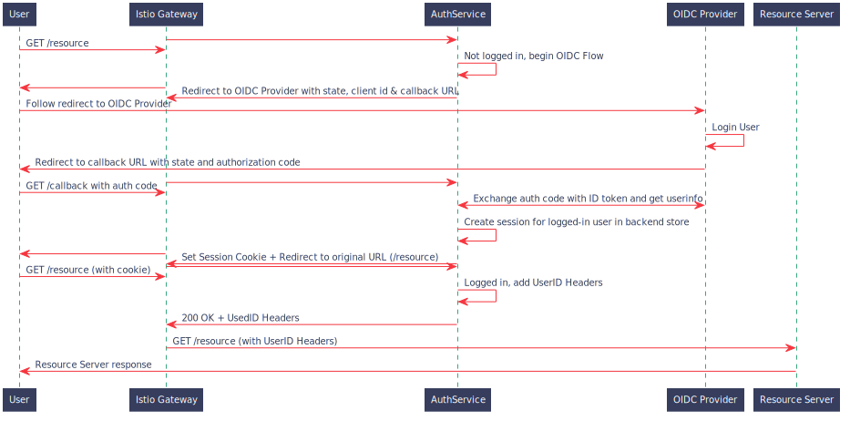

# OIDC AuthService

This is a rewrite of the [ajmyyra/ambassador-auth-oidc](https://github.com/ajmyyra/ambassador-auth-oidc) project.

An AuthService is an HTTP Server that an API Gateway (eg Ambassador, Envoy) asks if an incoming request is authorized.

For more information, see [this article](https://journal.arrikto.com/kubeflow-authentication-with-istio-dex-5eafdfac4782).

## OpenID Connect

[OpenID Connect (OIDC)](http://openid.net/connect/) is an authentication layer on top of the OAuth 2.0 protocol. As OAuth 2.0 is fully supported by OpenID Connect, existing OAuth 2.0 implementations work with it out of the box.

Currently it only supports OIDC's [Authorization Code Flow](http://openid.net/specs/openid-connect-basic-1_0.html#CodeFlow), similar to OAuth 2.0 Authorization Code Grant.

## Sequence Diagram for an Authentication Flow

## Design Docs

For more details on how various aspects of the AuthService are designed, see the design doc for the relevant section:
* [Logout](docs/logout.md)

## Options

Following environment variables are used by the software.

**Compulsary**
* **OIDC_PROVIDER** URL to your OIDC provider, for example: https://you.eu.auth0.com/
* **REDIRECT_URL** The URL that the OIDC provider will send the auth_code to. Also called callback URL. This should be in the form of: `<client_url>/login/oidc`.
* **OIDC_SCOPES** OIDC scopes wanted for userinfo, for example: "profile email".
* **CLIENT_ID** Client id for your application (given by your OIDC provider).
* **CLIENT_SECRET** Client secret for your application.

**Optional**
* **SERVER_HOSTNAME** Hostname to listen for requests. Defaults to all IPv4/6 interfaces (0.0.0.0, ::).
* **SERVER_PORT** Port to listen for requests. Default is 8080.
* **SKIP_AUTH_URI** Space separated whitelist of URIs like "/info /health" to bypass authorization. Contains nothing by default.
  **WARNING:** Make sure that the path in SKIP_AUTH_URI matches the path in the VirtualService definition of your Service Mesh. If it doesn't (eg you whitelist /dex and you match /dex/ in the VirtualService) you could leave resources exposed! (in this example, the /dex path is exposed)
* **CA_BUNDLE** Path to file containing custom CA certificates to use when connecting to an OIDC provider that uses self-signed certificates.
* **HOMEPAGE_URL** Homepage to use when user logs out or accesses the callback URL without any query parameters.
  The AuthService provides a default homepage, users can specify their own.
* **AFTER_LOGIN_URL** URL to redirect the user to after they log in. Defaults to "".
  * :warning: This option used to be called `STATIC_DESTINATION_URL`. For backwards compatibility, the
    old environment variable is also checked.
* **AFTER_LOGOUT_URL** URL to redirect the user to after they log out.

The AuthService provides a web server with some defaults pages for a homepage
and an after_logout page. The following values are about these pages. To
learn more about how these pages work, see [the templating guide](docs/templates.md).

By default, this web server is served at port `8082` and its endpoints are:
| Endpoint | Description |
| - | - |
| `/site/homepage` | Landing page |
| `/site/after_logout` | After Logout page |
| `/site/themes` | Themes |

To expose the web server in an environment like Kubernetes with Istio, you need to:
- Create a Service pointing to the AuthService's web server port.
- Set `WEB_SERVER_URL_PREFIX` to the path you want the AuthService site to live under.
- Create an Istio VirtualService to match traffic with the `$WEB_SERVER_URL_PREFIX`
   path-prefix and direct it to the Service you created.

The settings available for this web server are:
* **WEB_SERVER_TEMPLATE_PATH** A comma-separated list of dirs to look under for templates.
  Templates with the same name override previously registered ones. For more information,
  see [the templating guide](docs/templates.md).
* **WEB_SERVER_CLIENT_NAME** A human-readable name for the client. Used
  in the web server's pages. Defaults to `AuthService`.
* **WEB_SERVER_THEMES_URL** URL where the themes are served. The default value of this
  setting is `themes`. Theme assets are found under `$WEB_SERVER_THEMES_URL/$WEB_SERVER_THEME`.
  To learn how you can create your own theme, see [the templating guide](docs/templates.md).
* **WEB_SERVER_THEME** Theme to use for the AuthService web server pages. Defaults
  to `kubeflow`.
* **WEB_SERVER_URL_PREFIX** Defaults to `/authservice/`. The URL prefix under
  which the admin has allocated for the AuthService web server. For example,
  this `prefix` match setting in an Istio VirtualService. The AuthService needs
  to know where it's served, so it can compute correct values for the default
  `HOMEPAGE_URL` and `AFTER_LOGOUT_URL`.
    * `HOMEPAGE_URL` defaults to `$WEB_SERVER_URL_PREFIX/site/homepage`
    * `AFTER_LOGOUT_URL` defaults to `$WEB_SERVER_URL_PREFIX/site/after_logout`
    * `WEB_SERVER_URL_PREFIX` is added to the `SKIP_AUTH_URI` list. Controlled
      by `WEB_SERVER_PROTECT_URL_PREFIX` (default `off`)

OIDC-AuthService stores sessions and other state in a local file using BoltDB.
Other stores will be added soon.

OIDC AuthService can add extra headers based on the userid that was detected.
Applications can then use those headers to identify the user.

* **USERID_CLAIM** The claim whose value will be used as the userid (default `email`).
* **USERID_HEADER** The name of the header containing the userid (default `kubeflow-userid`).
* **USERID_TOKEN_HEADER** The name of the header containing the id_token. (default `kubeflow-userid-token`).
* **USERID_PREFIX** The prefix added to the userid, which will be the value of the header.

### Authentication Methods

The AuthService accepts credentials of the following form:

### AuthService Sessions

When the AuthService logs in a user, it creates a session for them and saves it
in its database. The session secret value is saved in a cookie in the user's
browser, named `authservice_session`.

The AuthService will then accept credentials in two forms:
1. The session cookie containing the secret value.
2. A header (`AUTH_HEADER`) containing the session's secret value.

## Usage

OIDC-Authservice is an OIDC Client, which authenticates users with an OIDC Provider and assigns them a session.
Can be used with:
* Ambassador with AuthService
* Envoy with the ext_authz Filter
* Istio with EnvoyFilter, specifying ext_authz

### Build

* Local: `make build`
* Docker: `make docker-build`

# E2E Tests

For the E2E tests, we setup build the AuthService and run it along with an OIDC Provider (Dex) as Docker containers.
Then, we issue requests to confirm we get the functionality we expect.
