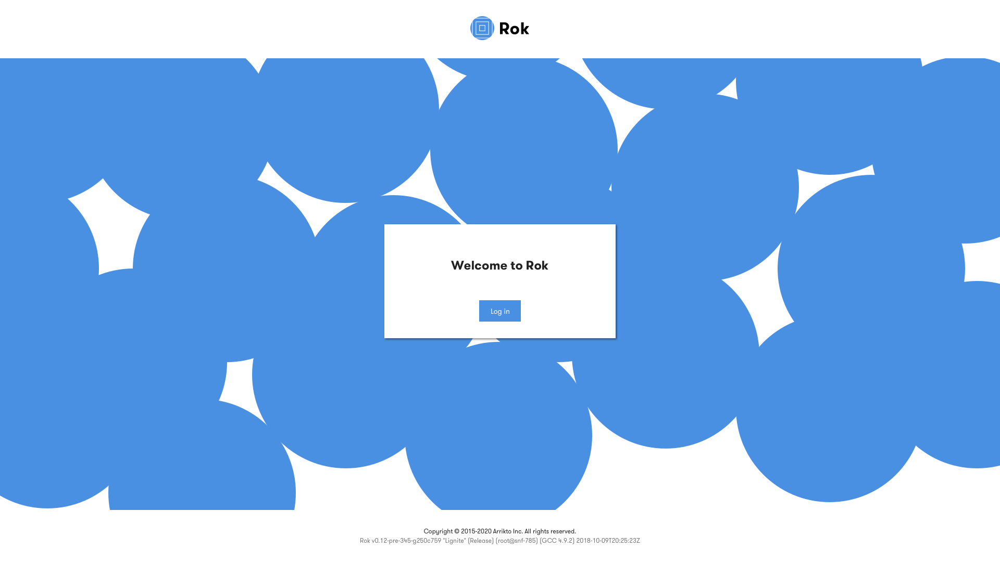

# Templates

The AuthService starts a web server for a couple of helper pages (`homepage`,
`after_logout`). These pages are rendered using HTML templating.

## Override templates

The file structure for the HTML templates is the following:

```
web
|---- templates
      |---- default
            |----homepage.html
            |----after_logout.html
```

You can override any predefined template using the `WEB_SERVER_TEMPLATE_PATH` environment
variable. The `TEMPLATE_PATH` setting defines a list of directories to look into
for templates (files ending in `.html`). Templates found in the `WEB_SERVER_TEMPLATE_PATH`
will be loaded and templates with the same name as the existing templates will
override them.

### Example

We want to make a custom logout page for GitLab, which includes a button to
GitLab's logout URL.

1. We create our own template for the page and name it `after_logout.html`.
1. We place this template in a folder named `gitlab`.
1. We set the `WEB_SERVER_TEMPLATE_PATH` to point to that folder:
   `WEB_SERVER_TEMPLATE_PATH=/path/to/gitlab`.
1. The AuthService starts and our template overrides the default
   `after_logout.html` template.

Here is what the final result could look like:

```
web
|---- templates
      |---- default
            |---- homepage.html
            |---- after_logout.html
      |---- gitlab
            |---- after_logout.html
```

Incidentally, the AuthService ships with a GitLab template that can be activated
by setting `TEMPLATE_PATH=/path/to/web/templates/gitlab`.

## Writing a template

We talked about overriding templates, but how can we write our own template?
Templates are rendered using the [Go template library](https://golang.org/pkg/text/template/).
To learn more about the syntax, please refer to the library documentation.

### Context

Templates render a page based on a context, which is values/functions available
only at runtime.

#### Values

Currently, the following values are passed in each template's context:
* `ProviderURL`: The URL of the OIDC Provider.
* `ClientName`: A human-readable name for the OIDC Client.
* `Theme`: Theme to use in frontend.

In addition, the user can provide their own values through
`TEMPLATE_CONTEXT_KEY=VALUE` environment variables. Those will be accessible in
a map named `Frontend` and can be accessed like so:
```html
{{index .Frontend "KEY"}}
```

#### Functions

The default funtions of the [Go template library](https://golang.org/pkg/text/template/#hdr-Functions).
In addition, the following functions are defined:
| Function | Description | Example |
| - | - | - |
| `resolve_url_ref` | Resolves a reference to the given URL. |
  `{{ resolve_url_ref "https://example.com" "/some/path" }}` returns `https://example.com/some/path` | 

### Themes

The default templates come with some predefines themes. A theme is a visual
customization of the page, while the content/structure remains unchanged. In
this case, a theme is a set of different images to use plus different CSS.

#### How it works

The default homepage page template has two themes available, `kubeflow` and `rok`.
Here is how they look side-by-side:

| Rok Theme | Kubeflow Theme |
| --------- | --------- |
|  |  |

We can see that the page structure is very much the same, but we have a
different background image, logo and styling. Here is what the template looks
like:

```html
{{ template "header.html" . }}

<body>
    <div class="wrapper">
      <header class="header">
        
      </header>
      <main class="main" style="background-image:url(assets/themes/{{ .Theme }}/bg.svg);">
        <div class="box">
          <div class="box-content">
            You have successfully logged out from {{.ClientName}}
          </div>
          <form class="button-wrapper" action="/" method="get" target="_self">
            <input class="button uppercase" type="submit" value="Log in" />
          </form>
        </div>
      </main>
    </div>
  </body>

{{ template "footer.html" . }}
```

We see that template will load a different image based on the theme chosen:
```html
        
...
      <main class="main" style="background-image:url(assets/themes/{{ .Theme }}/bg.svg);">
```

Themes live under `web/assets/themes` and their structure is:
```
web
|---- assets
      |---- themes
            |---- rok
                  |---- bg.svg
                  |---- logo.svg
                  |---- styles.css
            |---- kubeflow
                  |---- bg.svg
                  |---- logo.svg
                  |---- styles.css
```

#### Theme-Compatible Templates

Back to our GitLab example from before, we will write our GitLab
`after_logout.html` template to be compatible with the predefined themes. To do
so, it should make use of the theme assets, like the default `after_logout.html`
template.

```html
{{ template "header.html" . }}

<body>
    <div class="wrapper">
      <header class="header">
        
      </header>
      <main class="main" style="background-image:url(assets/themes/{{ .Theme }}/bg.svg);">
        <div class="box">
          <div class="box-content">
            You have successfully logged out from {{.ClientName}}
          </div>
          <form
            class="button-wrapper"
            action="{{resolve_url_ref .ProviderURL "/users/sign_out"}}"
            method="post"
            target="_self"
          >
            <input
              class="button uppercase"
              type="submit"
              value="Log out from GitLab"
            />
          </form>
        </div>
      </main>
    </div>
  </body>

{{ template "footer.html" . }}
```

Indeed, we keep the code largely the same and just add the extra button that we
needed at the end.

#### Custom Themes

To write your own theme, consult the structure under `web/assets/themes`.
Currently, the structure for a theme is the following, but it can be expanded in
the future:
```
rok
|---- bg.svg
|---- logo.svg
|---- styles.css
```
